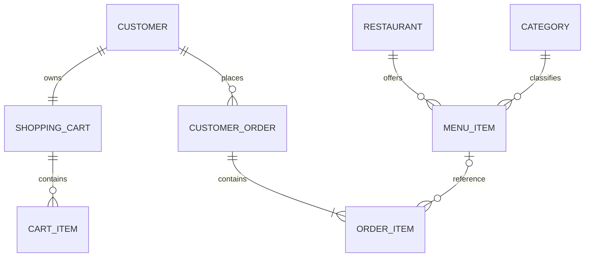

# Entity relationships

```mermaid
erDiagram
 CUSTOMER ||--|| SHOPPING_CART : owns
 CUSTOMER ||--o{ CUSTOMER_ORDER : places
 RESTAURANT ||--o{ MENU_ITEM : offers
 CATEGORY ||--o{ MENU_ITEM : classifies
 SHOPPING_CART ||--o{ CART_ITEM : contains
 CUSTOMER_ORDER ||--|{ ORDER_ITEM : contains
 MENU_ITEM o|--o{ ORDER_ITEM : reference
```
OrderItem stores item-name and price snapshots to preserve history.
